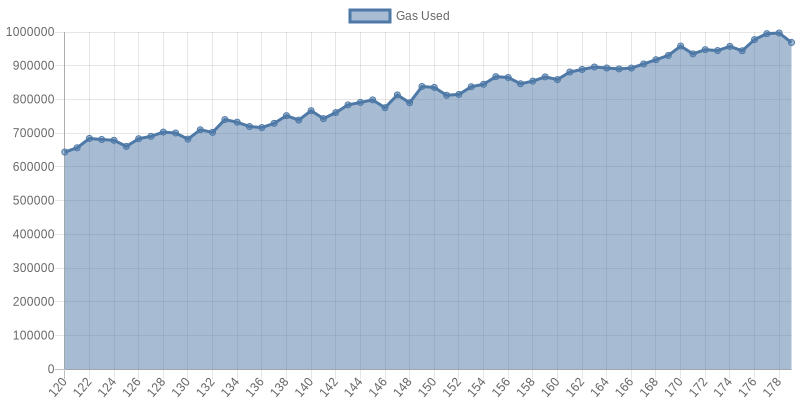
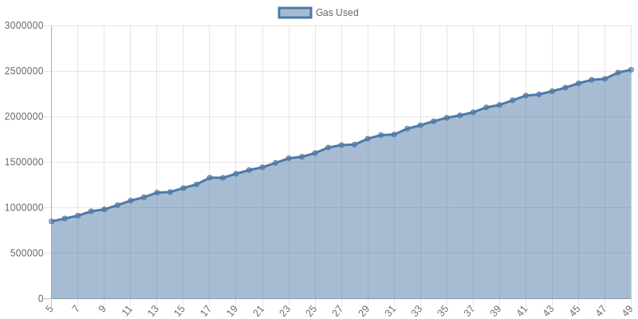

# Benchmarks

Measuring gas consumpations of the most critical functions.

# How to run

```
make node
make benchmark
```

# Benchmark



Gas consumption when executing the `updateValidatorsSet` function of the governance contract with different size validator set.



Gas consumption when executing the `trasferToERC20` function of the bridge contract with different batch size.